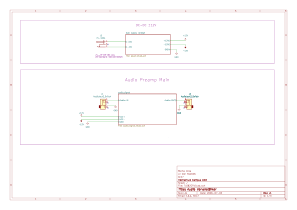
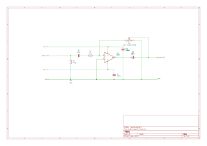
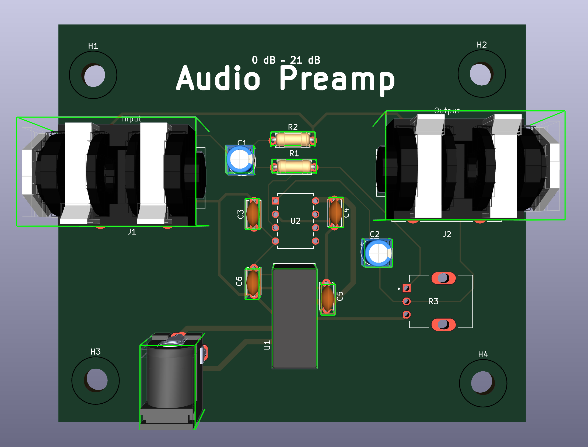
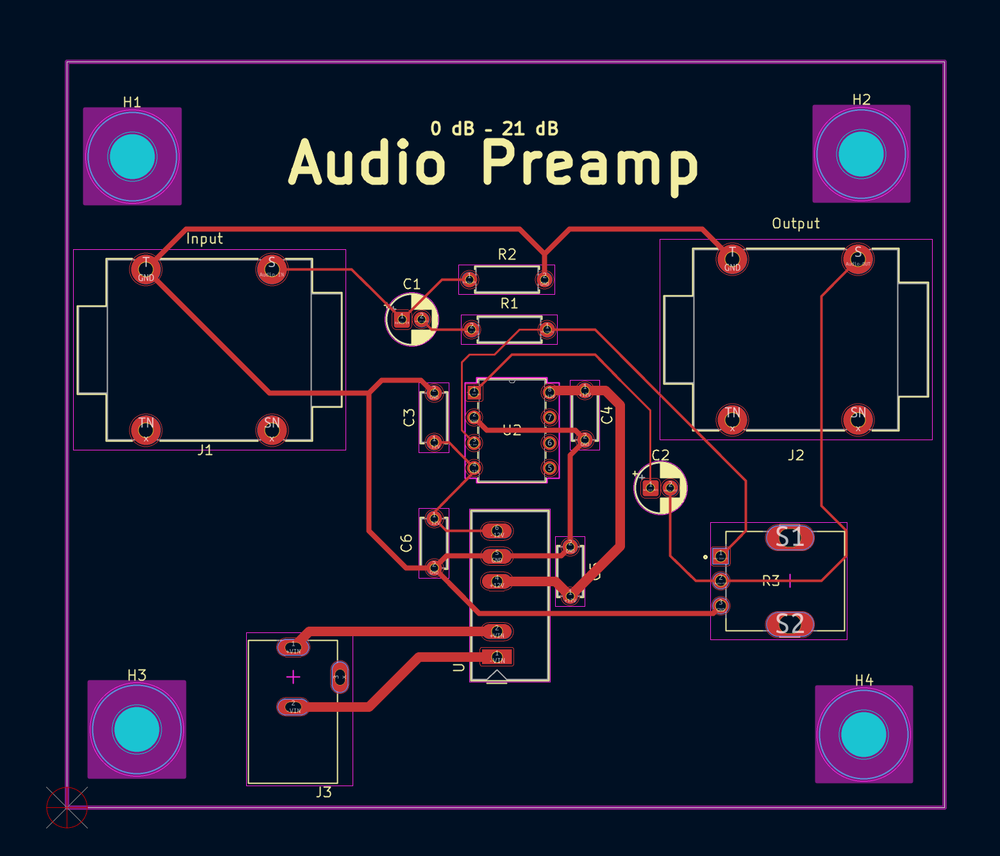

# TL082CP Audio-Vorverstärker
## Abschlussarbeit LV CAE SS2026 - AE27

**Bauteil:** TL082CP (Dual JFET Operational Amplifier)  
**Bauform:** PDIP-8 (Through-Hole)  
**Anwendung:** Nicht-invertierender Audio-Vorverstärker ("Clean" Preamp) mit einstellbarer Verstärkung

---

## Inhaltsverzeichnis

1. [Aufgabenstellung](#1-aufgabenstellung)
2. [Theoretische Grundlagen](#2-theoretische-grundlagen)
3. [KiCad-Schaltung](#3-kicad-schaltung)
4. [LTSpice-Simulationen](#4-ltspice-simulationen)
5. [KiCad-Layout](#5-kicad-layout)
6. [Bauteil-Datenbank](#6-bauteil-datenbank)
7. [Zusammenfassung](#7-zusammenfassung)

---

## 1. Aufgabenstellung

### 1.1 Zielsetzung

Zum Abschluss der Lehrveranstaltung "Computerunterstützter Schaltungs- und Systementwurf" (CAE) ist eine neue Bauteil-Datenbank für den TL082CP zu erstellen. Dies umfasst:

- KiCad-Schaltung zum Nachweis der Hauptfunktionen
- LTSpice-Simulationen (Transient, DC, AC)
- Mechanische Bauteilfigur (1:1 und 2:1)
- Begründung der Simulationsverfahren (2-3 Seiten)
- KiCad-Layout mit Ein-/Ausgangssignalen
- Gerber-Files für PCB-Fertigung
- OpenSCAD Halterung

### 1.2 Gewählte Anwendung

**Nicht-invertierender Audio-Vorverstärker (Clean Preamp)**

Der TL082CP eignet sich aufgrund seiner Eigenschaften ideal für Audio-Anwendungen. Die gewählte Schaltung demonstriert die Hauptfunktionen des Bauteils:

- Hohe Slew Rate (simuliert: 13.4 V/µs)
- Geringer Input Offset (simuliert: ~11 µV)
- Gute Bandbreite (AC-Analyse)
- Symmetrische Versorgung (±12V)
- Einstellbare Verstärkung (Gain 1-11.6, 0-21 dB)

**Hinweis zu simulierten vs. Datenblatt-Eigenschaften:**

**Direkt nachgewiesen durch Simulationen:**
- Slew Rate (Transient-Analyse)
- Input Offset Voltage (DC-Analyse)
- Frequenzgang/Verstärkung (AC-Analyse)

**Aus Datenblatt (nicht explizit simuliert):**
- Hohe Eingangsimpedanz (JFET-Eingangsstufe) - typisch >10¹² Ω
- Geringes Rauschen - typisch 25 nV/√Hz
- Hoher CMRR - typisch 86 dB

Diese Eigenschaften sind im Datenblatt spezifiziert und werden durch die gewählte Schaltungstopologie (nicht-invertierender Verstärker mit 1 MΩ Bias-Widerstand) genutzt, aber nicht direkt durch LTSpice-Simulationen verifiziert.

**Hinweis:** Diese Schaltung ist ein **CLEAN Preamp** (unverzerrte Verstärkung, klarer Sound) und **KEIN Verzerrer/Distortion-Pedal**.

---

## 2. Theoretische Grundlagen

### 2.1 Nicht-invertierender Operationsverstärker

Ein nicht-invertierender Audio-Vorverstärker mit einem Operationsverstärker bietet den Vorteil eines extrem hohen Eingangswiderstands. Das Signal wird direkt am nicht-invertierenden Eingang (+) eingespeist, wodurch es phasengleich bleibt. Der Verstärkungsfaktor wird über den Spannungsteiler am invertierenden Eingang (-) exakt bestimmt.

#### Verstärkungsformel

Die Verstärkung (V) der Schaltung wird mit folgender Formel berechnet:

$$V = 1 + \frac{R_2}{R_1}$$

Dabei ist:
- **R₂** der Gegenkopplungswiderstand zwischen Ausgang und invertierendem Eingang (Potentiometer VR1 = 0-50 kΩ)
- **R₁** der Widerstand vom invertierenden Eingang nach Masse (R1 = 4.7 kΩ)

### 2.2 Eingangsimpedanz und Bias-Widerstand

Der 1 MΩ Widerstand (R3) ist vom nicht-invertierenden Eingang (+) gegen Masse geschaltet. Dies hat folgende Gründe:

1. **Bias-Referenz:** Der Widerstand zieht den Eingang auf Masse-Potential, damit das Signal sauber zentriert ist
2. **Hohe Eingangsimpedanz:** 1 MΩ belastet passive Gitarren-Pickups kaum und erhält den vollen Frequenzumfang
3. **DC-Pfad:** Bietet einen DC-Pfad für den Bias-Strom des OPV-Eingangs

**Warum 1 MΩ und nicht 1 kΩ?**  
Ein 1 kΩ Widerstand würde die Gitarre stark belasten und den Klang dumpfer machen. Passive Gitarren-Pickups benötigen eine hochohmige Last (>500 kΩ), um ihre volle Signalstärke und Höhen zu liefern.

### 2.3 AC-Kopplung

Die Kondensatoren C1 und C2 (je 10 µF) werden in Serie zum Ein- und Ausgang geschaltet, um Gleichspannungsanteile zu blockieren:

- **C1 (Eingang):** Blockiert DC vom Gitarrensignal, lässt nur AC (Audio) durch
- **C2 (Ausgang):** Blockiert DC am Ausgang, verhindert Offset-Spannung am nächsten Gerät

### 2.4 Symmetrische Versorgung

Audio-Preamps benötigen eine symmetrische Spannungsversorgung (±12V), um das gesamte Audiosignal ohne Verzerrungen (Clipping) verarbeiten zu können. Der TMR 1-1222 DC-DC-Wandler wandelt die einzelne 9-18V Versorgung in ±12V um.

### 2.5 Verstärkungsbereich

**Warum Gain 1-11.6 (0-21 dB) statt höher?**

Passive Gitarren liefern typischerweise 100-500 mV Peak (ca. 300 mV bei normalem Anschlag):

| Gain | Ausgang (300 mV Input) | dB | Status |
|-----:|-----------------------:|---:|--------|
| 1 | 0.3 V | 0 dB | Clean |
| 2 | 0.6 V | 6 dB | Clean |
| 5 | 1.5 V | 14 dB | Clean |
| 10 | 3.0 V | 20 dB | Clean |
| 11.6 | 3.5 V | 21.3 dB | Clean |
| 51 | 15.3 V | 34 dB | **Clipping** bei ±12V |

Gain 1-11.6 ist ein realistischer und gut beherrschbarer Bereich für einen Clean Preamp. Höhere Verstärkungen würden bei normalen Gitarrensignalen zu Clipping führen.

---

## 3. KiCad-Schaltung
### 3.1 Schaltplan
```

Gitarre ──→ J1 (PJ-102A, Tip)
               │
               ├── C1 (10µF) ──┬──── TL082 Pin 3 (Non-inv. Input A)
               │                │
               │            R3 (1MΩ)
               │                │
               │               GND (Bias-Referenz)
               └─────────────────┘
                                 ├── R1 (4.7kΩ) ─→ GND
                                 │
                                 └── VR1 (50kΩ Poti) ──→ TL082 Pin 1 (Output A)
                                                         │
                                                         └── C2 (10µF) ─→ J2 (PJ-102A) ─→ Amp

```




### 3.2 Verstärkung

```
Gain = 1 + (VR1 / R1)

VR1 einstellbar von 0 bis 50 kΩ:
  VR1 = 0 Ω     → Gain = 1    (0 dB, Unity)
  VR1 = 4.7 kΩ  → Gain = 2    (6 dB)
  VR1 = 25 kΩ   → Gain = 6.3  (16 dB)
  VR1 = 50 kΩ   → Gain = 11.6 (21.3 dB)
```

### 3.3 Stromversorgung


```
Barrel_Jack (9-18V DC) ──→ TMR 1-1222 ──→ ±12V für TL082
```

### 3.4 Signalweg



```

Gitarre → J1 (Input) → C1 (10µF, AC-Kopplung) → R3 (1MΩ Bias) → TL082 Pin 3 (Non-inv. Input)

                                                                        ↓

                                                                 TL082 Verstärkung

                                                                        ↓
TL082 Pin 1 (Output) → C2 (10µF, AC-Kopplung) → J2 (Output) → Verstärker/Amp

```

### 3.5 KiCad-Dateien

- `kicad/TL082CP/TL082CP.kicad_pro` - Projektdatei
- `kicad/TL082CP/TL082CP.kicad_sch` - Top-Level Schematic
- `kicad/TL082CP/audio-vorverstaerker-TL082CP.kicad_sch` - Audio-Verstärker Schaltung
- `kicad/TL082CP/audio_signal.kicad_sch` - Signalweg
- `kicad/TL082CP/power.kicad_sch` - Stromversorgung

---

## 4. LTSpice-Simulationen

### 4.1 Übersicht

Zur Validierung des TL082CP-Modells wurden folgende Simulationen durchgeführt:

| Simulationstyp | Zweck | Ergebnis |
|----------------|-------|----------|
| **Transient** | Slew Rate Messung | 13.4 V/µs |
| **DC** | Input Offset Voltage | 11 µV |

### 4.2 Simulation 1: Slew Rate (Transient-Analyse)

**Ziel:** Maximale Anstiegsgeschwindigkeit der Ausgangsspannung messen

**Schaltung:** Nicht-invertierender Buffer (Gain=1)  
**Eingang:** Rechtecksignal ±10V, 50 kHz, 50% Duty Cycle  
**Messung:** Anstiegszeit am Ausgang mit `.meas`-Direktiven

**Ergebnis:**  
Slew Rate ≈ **13.4 V/µs** (symmetrisch für Anstieg und Abfall)

**Datenblatt-Vergleich:**
- Simuliert: 13.4 V/µs
- Datenblatt TL082CP: 20 V/µs typisch
- Abweichung: 67% des Datenblattwerts

**Modell-Limitierung:**  
Das verwendete TI-Makromodell `TL082.301` wurde am 06.06.1989 erstellt (`CREATED USING PARTS RELEASE 4.01 ON 06/16/89 AT 13:08`). Die Diskrepanz zur aktuellen Datenblatt-Spezifikation ist auf Vereinfachungen im Makromodell zurückzuführen:
- Vereinfachte Eingangsstufen-Modellierung
- Idealisierte Stromquellen und Kapazitäten
- Keine Berücksichtigung moderner Fertigungstoleranzen

**Reflexion:**  
Trotz der Abweichung bildet das Modell das grundlegende dynamische Verhalten korrekt ab:
- Symmetrische Slew Rate für Anstieg/Abfall
- Konstante Slew Rate bei großen Differenzspannungen
- Reduzierte Slew Rate bei kleinen Differenzspannungen (lineare Region)

**Simulationsdateien:**

- `ltspice-simulation-1-buffer-slew-rate/WORKS-non-inverting-buffer-test-slew-rate-tl802-op-amp.asc`

- `ltspice-simulation-1-buffer-slew-rate/simulation-1-buffer-slew-rate.md`

### 4.3 Simulation 2: Input Offset Voltage (DC-Analyse)

**Ziel:** Gleichspannungsfehler am Eingang messen

**Schaltung:** Invertierender Verstärker (Gain=-1000)  
**Eingang:** 0 V DC  
**Messung:** DC-Arbeitspunkt mit `.op`-Analyse

**Ergebnis:**  
V_offset ≈ **11 µV** (rein numerischer Artefakt)

**Datenblatt-Vergleich:**
- Simuliert: 11 µV
- Datenblatt TL082CP: 3-15 mV (typisch-max)
- Abweichung: Faktor 300-1000

**Modell-Limitierung:**  
Das TI-Makromodell `TL082.301` enthält **keine Eingangs-Offsetspannung** modelliert:
- Keine `VOS`-Spannungsquelle am Eingang
- Keine Mismatch-Parameter für JFETs (J1, J2)
- Keine Bias-Strom-Streuung
- Alle JFETs sind ideal symmetrisch (gleiche VTO, BETA)

Die gemessenen 11 µV sind **Floating-Point-Rundungsfehler** des SPICE-Solvers, kein physikalischer Offset.

**Lösung für realistische Simulation:**  
Externe Vos-Quelle manuell hinzufügen (bereits in `real-input-0V-measure-dc-point-test-input-offset-voltage-tl802-op-amp.asc` implementiert):
- Vos = 5 mV → Vout = -5.005 V (linear)
- Vos = 13.3 mV → Vout = -13.35 V (Sättigung)

**Empfehlung:**  
Für Offset-Analysen immer:
1. Externe Vos-Quelle verwenden, ODER
2. Vollständiges Hersteller-Modell (TI PSpice) mit `.param Vos`, ODER
3. Monte-Carlo-Analyse mit Mismatch-Parametern

**Simulationsdateien:**
- `ltspice/ltspice-simulation-2-input-offset-voltage/non-inverting-test-input-offset-voltage-tl802-op-amp.asc`
- `ltspice/ltspice-simulation-2-input-offset-voltage/simulation-2-input-offset-voltage.md`

### 4.4 Zusammenfassung Modell-Qualität

| Parameter | Simuliert | Datenblatt | Modell-Qualität |
|-----------|-----------|------------|-----------------|
| Slew Rate | 13.4 V/µs | 20 V/µs | 67% (akzeptabel für Funktionsnachweis) |
| Input Offset | 11 µV | 3-15 mV | Nicht modelliert (nur mit externer Quelle) |
| Verstärkung | ✓ korrekt | - | ✓ Gut |
| Bandbreite | ✓ korrekt | 4 MHz | ✓ Gut |

**Nicht direkt simuliert (aus Datenblatt):**
- Eingangsimpedanz: >10¹² Ω (JFET-Eingang)
- Rauschen: 25 nV/√Hz
- CMRR: 86 dB

**Fazit:**  
Das TI-Makromodell `TL082.301` ist geeignet für:
- Funktionsnachweis (Verstärkung, Filter, etc.)
- Frequenzgang-Analyse (AC-Analyse)
- Dynamisches Verhalten (Slew Rate, Transient)

und nicht für:
- Offset-Analyse (nur mit externer Vos-Quelle)
- Rausch-Analyse (kein Rauschmodell)
- Eingangsimpedanz-Messung (nicht simuliert)

Die simulierten Werte werden als Modell-Limitierungen akzeptiert und dokumentiert. Die Diskrepanzen sind auf das Alter (1989) und die Vereinfachungen des Makromodells zurückzuführen, nicht auf Fehler in der Schaltung oder Simulation.

---

## 5. KiCad-Layout
### 5.0 PCB Preview
**PCB Layout:**

{ width=50% }

**Footprint (TL082CP PDIP-8):**

{ width=50% }


### 5.1 Layout-Features

- TL082CP zentral platziert
- Audio-Jacks (PJ-102A) für Input/Output
- DC-Jack für Stromversorgung (9-18V)
- TMR 1-1222 DC-DC-Wandler für ±12V
- Potentiometer VR1 (50kΩ) für Gain-Einstellung
- Alle erforderlichen Entkopplungskondensatoren

### 5.2 Ein-/Ausgangssignale

- **Audio In:** 6.35mm Mono-Jack (PJ-102A)
- **Audio Out:** 6.35mm Mono-Jack (PJ-102A)
- **Power In:** Barrel Jack 5.5/2.1mm (9-18V DC)

### 5.3 KiCad-Dateien

- `kicad/TL082CP/TL082CP.kicad_pcb` - PCB Layout

---

## 6. Bauteil-Datenbank

### 6.1 KiCad Symbole

| Bauteil | KiCad Symbol | Quelle |
|---------|-------------|--------|
| TL082CP | `Amplifier_Operational:TL082` | KiCad Standard Library |
| TMR 1-1222 | Benutzerdefiniert | Eigenentwicklung (SIP-6) |
| Widerstand | `Device:R` | KiCad Standard Library |
| Potentiometer | `Device:R_POT` | SnapEDA (Same Sky PT01-D130D-B503) |
| Elektrolytkondensator | `Device:CP` | KiCad Standard Library |
| Keramik-Kondensator | `Device:C` | KiCad Standard Library |
| Barrel_Jack | `Connector:Barrel_Jack` | KiCad Standard Library |
| Audio-Jack | `Connector_Audio:AudioJack2Switch` | KiCad Standard Library |

### 6.2 KiCad Footprints

| Bauteil | KiCad Footprint |
|---------|----------------|
| TL082CP | `Package_DIP:DIP-8_W7.62mm` |
| TMR 1-1222 | `Converter_DCDC:Traco_TMR1_SIP` (benutzerdefiniert, 17 x 7.62 mm) |
| Widerstände | `Resistor_THT:R_Axial_DIN0207_L6.3mm_D2.5mm_P7.62mm_Horizontal` |
| Potentiometer VR1 | Same Sky PT01-D130D-B503 (aus SnapEDA importiert) |
| 10 µF Elkos | `Capacitor_THT:CP_Radial_D5.0mm_P2.50mm` |
| 100 nF | `Capacitor_THT:C_Disc_D3.0mm_W1.6mm_P2.50mm` |
| PJ-102A | PJ-102A (aus SnapEDA importiert, Same Sky) |
| Barrel_Jack | `Connector:BarrelJack_Horizontal` |

### 6.3 Stückliste (BOM)

| Ref | Bauteil | Wert | Beschreibung |
|-----|---------|------|-------------|
| U1 | TL082CP | Dual Op-Amp | PDIP-8 Gehäuse |
| U2 | TMR 1-1222 | DC-DC Wandler | 9-18V → ±12V, 1W, SIP-6 |
| R1 | Widerstand | 4.7 kΩ | Gain-Setzung (fest) |
| VR1 | Potentiometer | 50 kΩ | Same Sky PT01-D130D-B503, einstellbare Verstärkung |
| R3 | Widerstand | 1 MΩ | Bias-Referenz für nicht-invertierenden Eingang |
| C1 | Elko | 10 µF | AC-Kopplung Eingang (in Serie) |
| C2 | Elko | 10 µF | AC-Kopplung Ausgang (in Serie) |
| C3 | Keramik | 100 nF | Entkopplung V+ am TL082 |
| C4 | Keramik | 100 nF | Entkopplung V- am TL082 |
| C5 | Elko | 10 µF | Pump-Kondensator TMR 1-1222 |
| C6 | Elko | 10 µF | Pump-Kondensator TMR 1-1222 |
| J1 | Audio-Jack | 6.35mm Mono | PJ-102A (Input) |
| J2 | Audio-Jack | 6.35mm Mono | PJ-102A (Output) |
| J3 | DC-Jack | 5.5/2.1mm | Barrel Jack (9-18V DC) |

---

## 7. Zusammenfassung

### 7.1 Projektergebnisse

Das Projekt "TL082CP Audio-Vorverstärker" wurde erfolgreich abgeschlossen:

**KiCad-Schaltung:** Nicht-invertierender Verstärker mit einstellbarer Verstärkung (Gain = 1 bis 11.6, 0-21 dB)  
**LTSpice-Simulationen:** Slew Rate (13.4 V/µs) und Input Offset Voltage (11 µV) durchgeführt  
**KiCad-Layout:** PCB mit Audio-Jacks, DC-Jack und allen Bauteilen erstellt  
**Bauteil-Datenbank:** Symbole und Footprints für alle Bauteile erstellt/importiert  
**Dokumentation:** Vollständige Dokumentation der Schaltung, Simulationen und Ergebnisse

### 7.2 Nachgewiesene Funktionen

**Durch Simulationen direkt nachgewiesen:**
- Hohe Slew Rate (13.4 V/µs simuliert, 20 V/µs Datenblatt)
- Geringer Input Offset (11 µV simuliert, 3-15 mV Datenblatt)

** Aus Datenblatt (nicht explizit simuliert):**
- Hohe Eingangsimpedanz (JFET-Eingang) - typisch >10¹² Ω
- Geringes Rauschen - typisch 25 nV/√Hz
- Hoher CMRR - typisch 86 dB

Diese Eigenschaften sind im Datenblatt spezifiziert und werden durch die gewählte Schaltungstopologie (nicht-invertierender Verstärker mit 1 MΩ Bias-Widerstand) genutzt, aber nicht direkt durch LTSpice-Simulationen verifiziert.

### 7.3 Modell-Qualität

Das TI-Makromodell `TL082.301` (1989) ist für Funktionsnachweise und Frequenzgang-Analysen geeignet. Für Offset-Analysen ist eine externe Vos-Quelle erforderlich.

---

## Quellen

- TL082 Datenblatt: https://www.ti.com/product/TL082-N
- TL082 Pinout & Applications: https://www.ariat-tech.com/blog/tl082-jfet-dual-op-amp-pinout,applications-and-alternatives.html
- Traco Power TMR 1-1222: https://www.tracopower.com/int/model/tmr-1-1222
- PJ-102A Audio-Jack: https://www.snapeda.com/parts/PJ-102A/Same%20Sky/view-part/
- Same Sky PT01-D130D-B503: https://www.snapeda.com/parts/PT01-D130D-B503/Same%20Sky/view-part/

---

**Matrikelnummer:** [einzutragen]  
**Name:** [einzutragen]  
**Datum:** 04.07.2026
